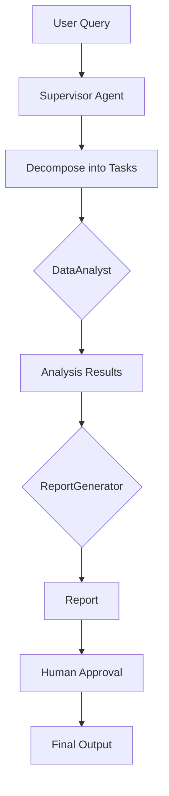

# Enterprise Multi-Agent Orchestration

## 📌 Overview
This repository demonstrates a **production-grade multi-agent orchestration framework** using LangGraph and LangChain. Unlike simple chatbots, this system utilizes a "Supervisor" pattern to decompose complex queries into tasks for specialized agents, ensuring autonomous problem-solving with real data.

## 🏗️ Architectural Design
- **Supervisor Pattern:** Central agent decomposes queries into tasks for DataAnalyst and ReportGenerator.
- **Graph-based State Machine:** Manages transitions with Human-in-the-loop breakpoint.
- **Tool Integration:** DataAnalyst uses SQLTool (real SQLite database) and WebSearchTool (DuckDuckGo API).
- **Enterprise Features:** Structured output, logging/tracing, async execution.

### System Flow

## 🚀 Quick Start
1. **Install dependencies:** `pip install -r requirements.txt`
2. **Generate sample data:** `python data/generate_data.py`
3. **Set up environment:** `cp .env.example .env` and add your OpenAI API key
4. **Run:** `python main.py`

## 📁 Structure
- `/agents`: Supervisor, DataAnalyst, ReportGenerator agents
- `/tools`: SQLTool (SQLite), WebSearchTool (DuckDuckGo API)
- `/schema`: Pydantic models for structured data
- `/data`: Sample data generation and SQLite database
- `/tests`: Pytest test suite
- `main.py`: Async entry point with graph orchestration

## 💾 Data Requirements
The framework includes a complete data pipeline:

### Database Schema
- **sales**: Raw transaction data (date, product, region, quantity, price, revenue, customer_id)
- **monthly_sales**: Aggregated monthly performance
- **product_performance**: Product-level analytics
- **regional_performance**: Regional sales analysis

### Data Generation
Run `python data/generate_data.py` to create:
- 3,449+ sample sales records
- SQLite database with pre-built analytics views
- Realistic sales data for widgets and gadgets across regions

### External Data
- **Web Search**: Uses DuckDuckGo Instant Answer API (no API key required)
- **Fallback**: Enhanced mock data for offline operation

## 🧪 Testing
Run tests: `pytest`

## 🐳 Docker
Build: `docker build -t enterprise-agent-orchestrator .`
Run: `docker run -e OPENAI_API_KEY=your_key enterprise-agent-orchestrator`

## 📊 Example Queries
- "Analyze quarterly sales performance and market trends"
- "Generate regional sales report with product insights"
- "Compare product performance across different regions"

