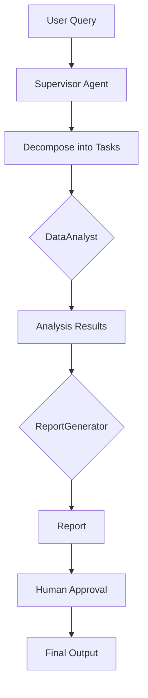

# Enterprise Multi-Agent Orchestrator

## 📌 Overview
This repository demonstrates a **production-grade multi-agent orchestration framework** using LangGraph and LangChain. Unlike simple chatbots, this system utilizes a "Supervisor" pattern to decompose complex business queries into tasks for specialized agents, ensuring autonomous problem-solving.

## 🏗️ Architectural Design
- **Supervisor Pattern:** Central agent decomposes queries into tasks for DataAnalyst and ReportGenerator.
- **Graph-based State Machine:** Manages transitions with Human-in-the-loop breakpoint.
- **Tool Integration:** DataAnalyst uses SQLTool and WebSearchTool with Pydantic validation.
- **Enterprise Features:** Structured output, logging/tracing, async execution.

### System Flow

## 🚀 Quick Start
1. Install dependencies: `pip install -r requirements.txt`
2. Set up environment: `cp .env.example .env` and add your OpenAI API key
3. Run: `python main.py`

## 📁 Structure
- `/agents`: Supervisor, DataAnalyst, ReportGenerator agents
- `/tools`: SQLTool, WebSearchTool
- `/schema`: Pydantic models
- `/tests`: Pytest test suite
- `main.py`: Async entry point
- `pyproject.toml`: Modern Python packaging
- `Dockerfile`: Containerization

## 🧪 Testing
Run tests: `pytest`

